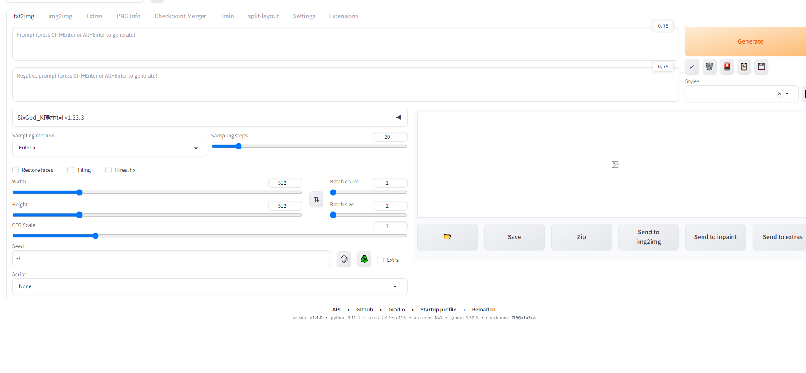
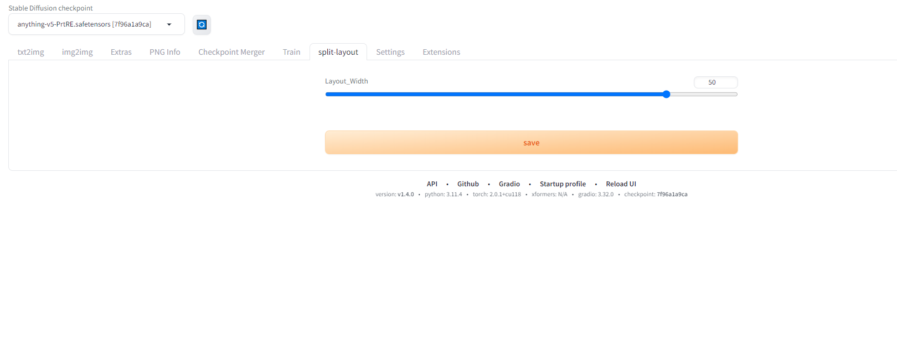
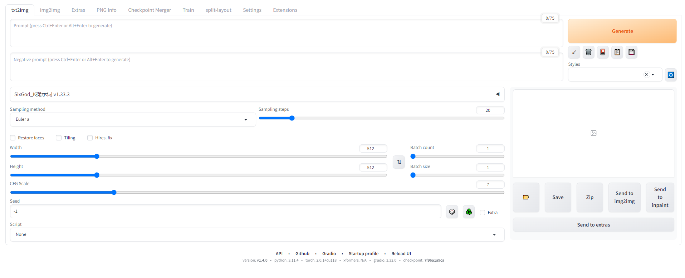

# sd-webui-split-layout

## 针对sd-webui左右布局调整大小，习惯原始风格界面的可以试试

#### for those who prefer the original style interface, you can try adjusting the size of the layout using this extension

### 原始界面

### 扩展界面

### 修改后界面

